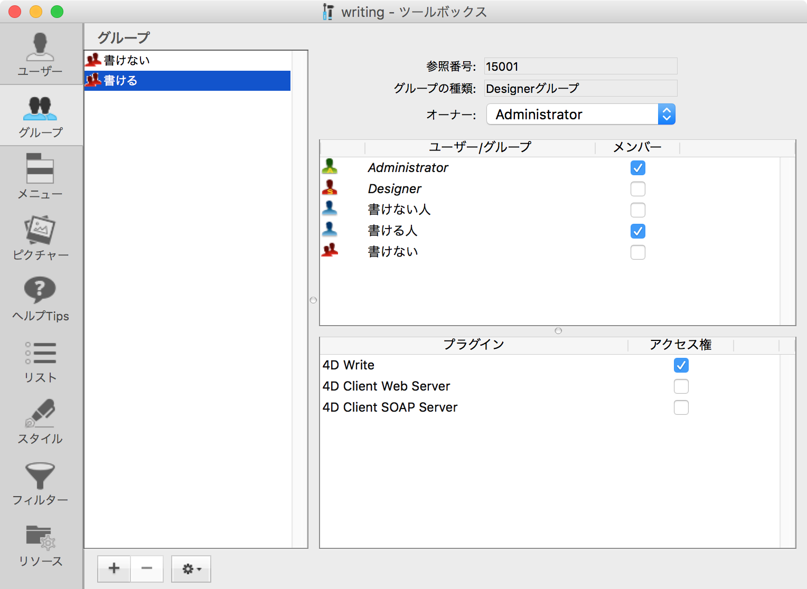
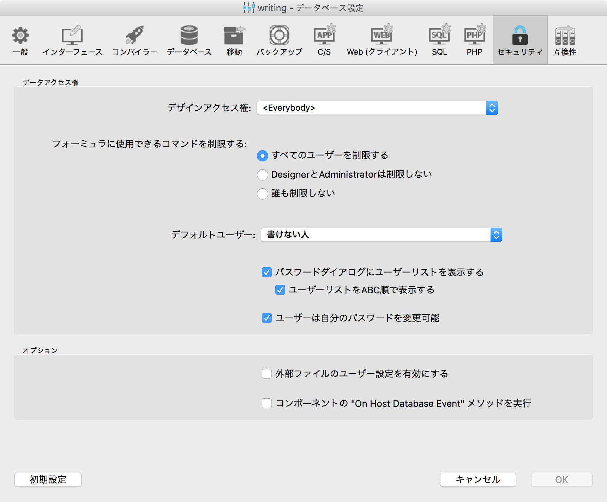
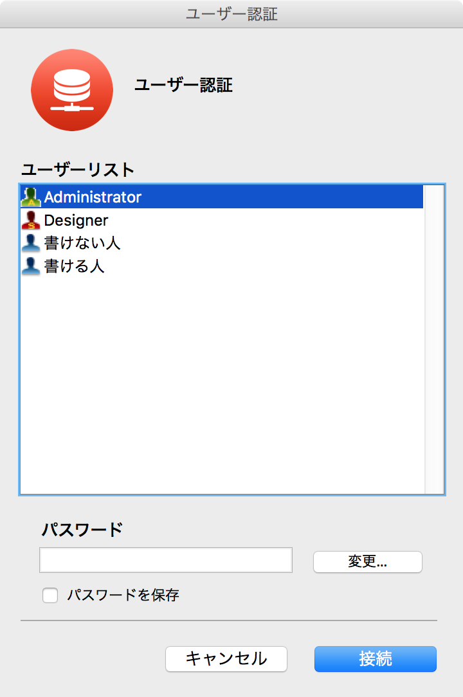
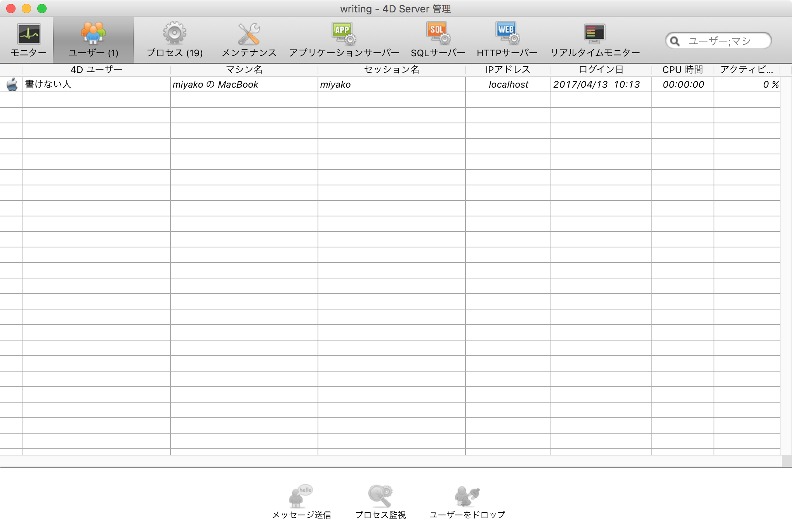
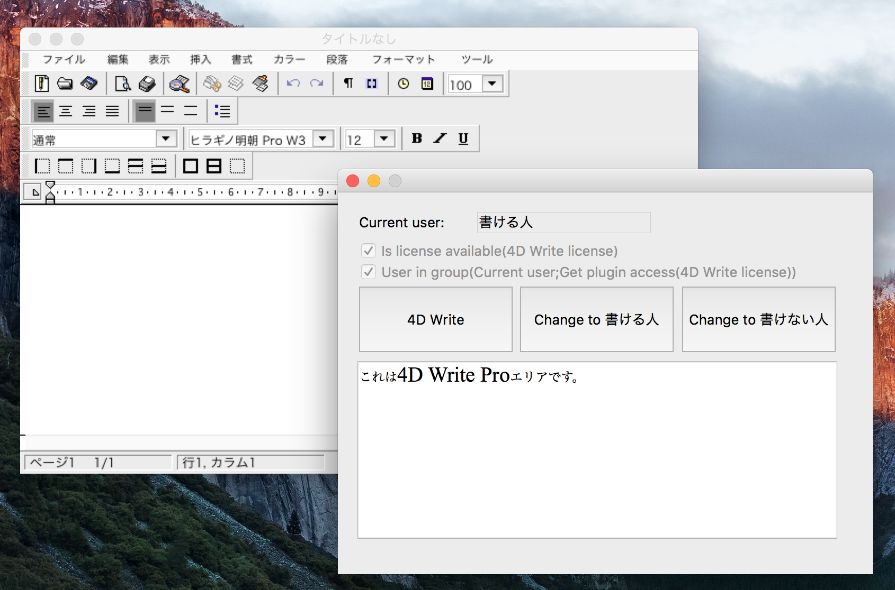

# 4d-tips-grant-revoke-license
4D Write/4D Write Proのライセンス管理について

## 概要

[4D Write Pro](http://doc.4d.com/4Dv16/4D/16/Presentation.200-3048089.ja.html)は，4Dに組み込まれており，プラグインではありませんが，使用には4D Write（プラグイン）の追加ライセンスが必要です（Webサーバー・SOAPサーバーと同じ扱い）。4D Writeのライセンスは，4D Developer Proおよび4D Unlimited Desktop（ビルドされたシングルユーザー版アプリケーション）に含まれているので，これらの場合には無条件で使用することができます。クライアント/サーバー版の場合，同時接続ユーザー（4D Client）と同じ数の4D Writeのライセンスをインストールする必要はありませんが，その場合，[ユーザー/グループ](http://doc.4d.com/4Dv16/4D/16/Access-system-overview.300-3049059.ja.html)の仕組みを活用して4D Writeのライセンスを特定のユーザーに割り当てる必要があります。（**注記**：4D Developer Standardに4D Writeライセンスを"追加"することはできません。）

### 基本

ユーザー/グループは，特定のフォーム・メニュー・プラグイン等に対するアクセス権を管理するための仕組みです。（**注記**：特定のテーブルに対するアクセスを管理するためにはSQLの[スキーマ](http://doc.4d.com/4Dv16/4D/16/CREATE-SCHEMA.300-3201309.ja.html)を使用します。）

ユーザー/グループは，デフォルトで無効となっています。[Designerにパスワードを設定する](http://doc.4d.com/4Dv16/4D/16/Activating-access-control.300-3049054.ja.html)ことにより，これを有効にすることができます。

4D Write Proに対するアクセス権を管理するためには，まず，グループを作成し，そのグループに4D Writeライセンスを与えます。この例では，グループ「書ける」に4D Writeライセンスが与えられています。グループ「書けない」には，4D Writeライセンスが与えられていません。次に，ユーザーを作成し，グループに所属させます。この例では，ユーザー「書ける人」がグループ「書ける」に所属し，ユーザー「書けない人」はグループ「書けない」に所属しています。

最小限のアクセス権を有する標準のユーザーを[デフォルトユーザー](http://doc.4d.com/4Dv16/4D/16/Setting-a-Default-User.300-3049055.ja.html)に指定することにより，ログイン画面を省略することもできます。この例では，「書けない人」がデフォルトユーザーに設定されています。

**注記**: D Writeプラグインがインストールされていない場合，ツールボックスのグループ管理画面に4D Writeのライセンスが表示されません。デスクトップ版の場合，4D Writeプラグインは，アプリケーションに組み込まれているので，常にライセンスが表示されます。クライアント/サーバー版の場合，ストラクチャと同じ階層の``Plugins``フォルダーに4D Writeプラグインがインストールされている必要があります。

Designer/Administrator以外のユーザーは，ユーザー/グループを管理することができません。アクセス権をDesigner/Administratorに「昇格」するためには，[CHANGE CURRENT USER](http://doc.4d.com/4Dv16/4D/16/CHANGE-CURRENT-USER.301-3036847.ja.html)コマンドを使用するか，``Shift``キーを押しながら再度アプリケーションを開き，ログイン画面からDesigner/Administratorとしてログインします。

## アクセス権が与えられるタイミング

ログインまたはCHANGE CURRENT USERコマンドの使用により，カレントユーザーが確定した時点で，クライアントマシンのグループすなわちアクセス権が与えられます。カレントユーザーは，[Current user](http://doc.4d.com/4Dv16/4D/16/Current-user.301-3036855.ja.html)またはサーバーの管理画面で確認することができます。

特定のライセンスがインストールされているかどうかは，[Is license available](http://doc.4d.com/4Dv16/4D/16/Is-license-available.301-3036846.ja.html)で確認することができます。

特定のライセンスを使用できるかどうかは，[Get plugin access](http://doc.4d.com/4Dv16/4D/16/Get-plugin-access.301-3036854.ja.html)で確認することができます。

特定のライセンスを使用するため，別のグループに昇格するためには，[CHANGE CURRENT USER](http://doc.4d.com/4Dv16/4D/16/CHANGE-CURRENT-USER.301-3036847.ja.html)を使用します。

4D Writeのライセンス数が接続ユーザー数よりも少ない場合，ログインまたはCHANGE CURRENT USERコマンドを使用した順にライセンスが配分されてゆきます。

4D Writeプラグインエリアおよび4D Write Proエリアは，フォームが開かれた時にアクセス権がチェックされるため，途中でアクセス権を昇格した場合，各エリアが使用できるようになるのは次に開かれたフォームからとなります。また，アクセス権を昇格した時点でライセンスが余っていなかった場合，アクセス権を持つ別のユーザーがログアウトまたは降格した後，改めてログインまたはCHANGE CURRENT USERコマンドを使用する必要があります。

## サンプルアプリケーション

v15で作られた簡単なアプリケーションです。デフォルトユーザー「書けない人」には，4D Writeライセンスが与えられていません。4D Writeプラグインエリアまたは4D Write Proエリアを使用するためには，「書ける人」に昇格する必要があります。アクセス権が与えられても，同一フォーム上に存在する4D Write Proエリアは使用できません，しかし，メニュー「Demo」から開いたフォームでは，使用することができます。

https://github.com/4D-JP/4d-tips-grant-revoke-license/releases/tag/1.0.0
